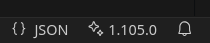

# VSC-Info
The extensions show the current VS Code version in the status bar and can collect information about VS Code, extensions and the system.

## StatusBar
The information in the status bar was the main feature for me to build this extension. I work on different systems with different VS Code versions, not all of these systems have auto-update functionality. The status bar shows directly which version is running.



## Collect information
The extension can collect information about

- VS Code
- Extensions
- System

in a JSON file.

```json
{
  "vscode": {
    "name": "Visual Studio Code",
    "version": "1.95.2",
    "language": "en"
  },
  "extensions": [
    {
      ...
    }
  ],
  "system": {
    "platform": "linux",
    "arch": "x64",
    "cpus": [
      {
        ...
      }
    ],
    "totalmem": ...,
    "freemem": ..,
    "hostname": ...,
    "uptime": ...,
    "networkInterfaces": {
      "lo": [
        {
          ...
        }
      ],
      "wlan0": [
        {
          ...
        }
      ]
    },
    "userInfo": {
        ...
    }
  }
}
```

## Versioning
YY.MM.VERSION

- YY: Release year
- MM: Release month
- VERSION: Version in year/month