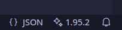

# VSC-Info
Shows the Current VS Code version in the status bar.

## Why
I use VS Code on different systems with different VS Code Versions. Not all systems have auto-update functionality. The information in the status bar helps you immediately identify which version you are using.